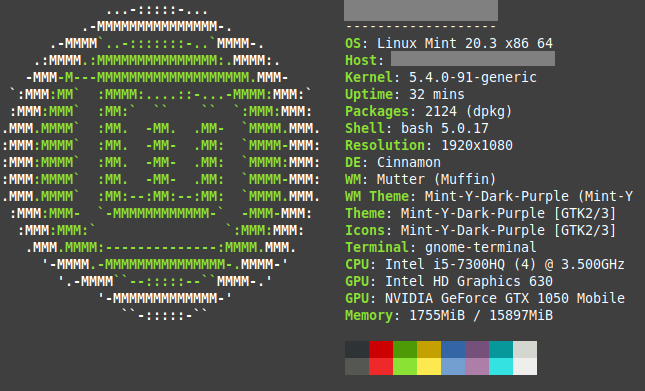

## Nome do seu projeto
> Um resumo curto sobre o que o seu projeto faz.

Um ou dois parágrafos sobre seu projeto e o que ele faz.



## Instalação

OS X & Linux:

```shell
npm install --save
```

Windows:
```shell
edit autoexec.bat
```

## Exemplo de uso

Alguns exemplos de utilização e motivos do seu projeto existir.

## Ambiente de Desenvolvimento

Descrever como instalar e preparar qualquer dependência de desenvolvimento para que seu projeto possa ser executado localmente. Seja no Windows, Linux ou Mac OS.

## Histórico de Updates

* 0.2.1
    * CHANGE: Mudança X, Y e Z
* 0.2.0
    * CHANGE: Removida a função `XyZ`
    * ADD: Adicionando função `inicializar()`
* 0.1.1
    * FIX: Crash quando executava `exemplo` (Obrigado ao @Contribuidor)

## Meta

Fulano da Silva - [@Twitter](https://twitter.com.br/neymarjr) - fulano@gmail.com
Distribuido sobre a licença. Veja `LICENÇA` para mais informações